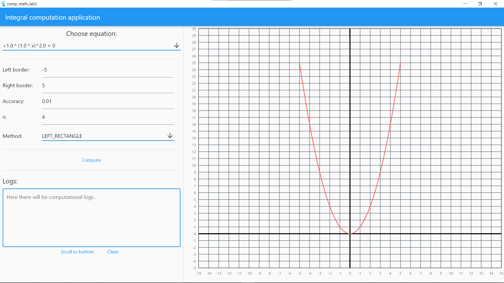
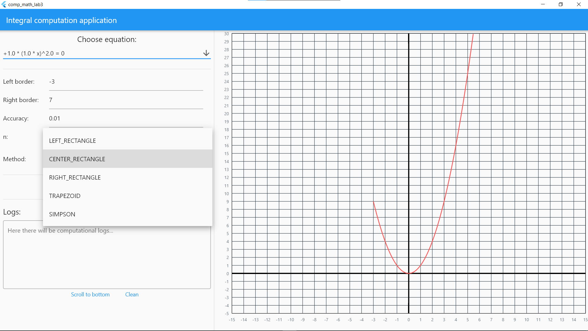
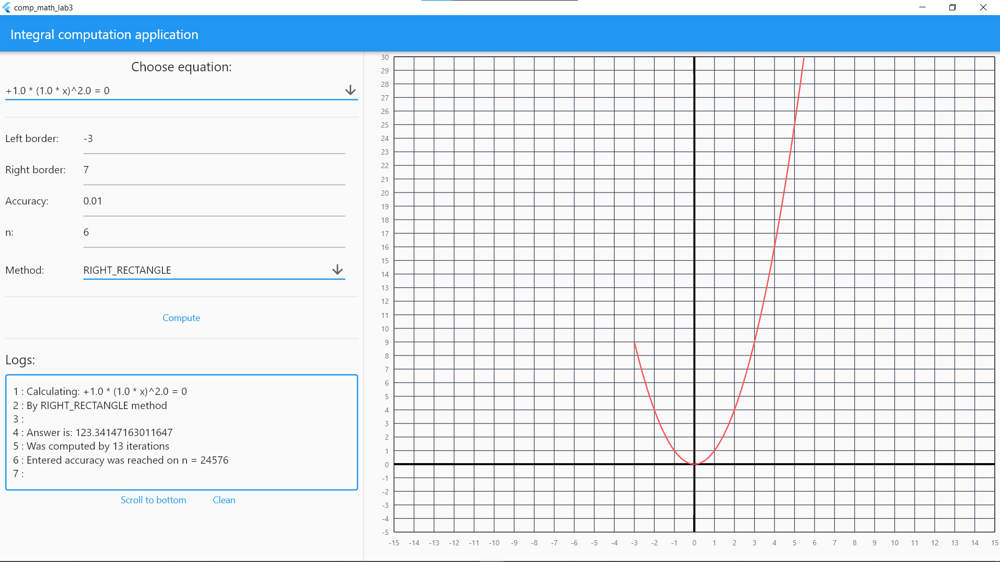

# Computational math lab 3

[![GitHub stars][stars-shield]][stars-url]
[![GitHub issues][issues-shield]][issues-url]
[![GitHub][license-shield]][license-url]

## Стек технологий:
- Flutter
- GetX
- fl_chart

## О проекте
Классическая реализация методов строго по формулам, и ничего более (иронично что код методов всего 100 строк, когда реализация GUI и соответствующей бизнес логики около 900 строк).

##  Как заставить работать
Понадобится AndroidStudio или IntelliJIdea с плагинами Dart и Flutter. 

## Как выглядит

[stars-shield]: https://img.shields.io/github/stars/burevestnik-png/comp-math-lab3?style=social
[stars-url]: https://github.com/burevestnik-png/comp-math-lab3/stargazers
[issues-shield]: https://img.shields.io/github/issues/burevestnik-png/comp-math-lab3
[issues-url]: https://github.com/burevestnik-png/comp-math-lab3/issues
[license-shield]: https://img.shields.io/github/license/burevestnik-png/comp-math-lab3
[license-url]: https://github.com/burevestnik-png/comp-math-lab3/blob/master/LICENSE